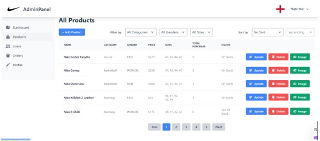
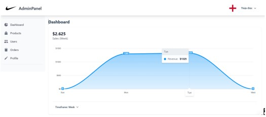
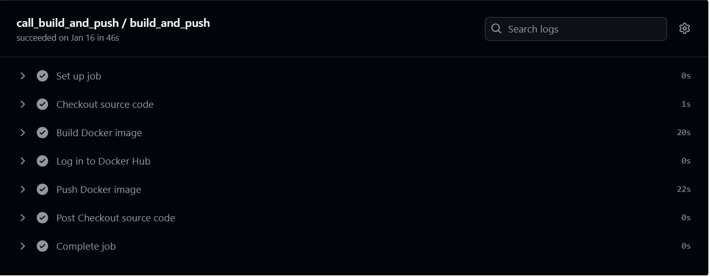
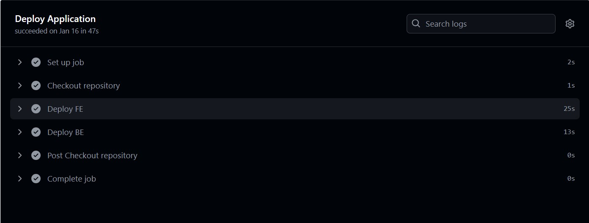

# Admin Panel for Web Application

## Overview
This is an Admin Panel designed for managing users, products, and orders for an e-commerce web application. It provides a user-friendly interface to manage the core functionalities of the platform, including user accounts, product listings, and orders. 

The panel is built with a robust backend using Express.js and the frontend utilizes EJS templates for dynamic content rendering. The application is fully containerized using Docker, and the CI/CD pipeline ensures seamless integration and deployment.

## Features

### 1. **Product Management**
   - **Categories & Manufacturers**: Manage and categorize products into specific categories and manufacturers.
   - **Product List**: Filter products by name, category, manufacturer. Sort products by creation time, price, or total purchases. The product list supports AJAX paging.
   - **Create & Update Products**: Admins can upload multiple product photos, specify product status, and assign products to categories or manufacturers. The form validates user input to ensure accuracy.
   - **Product Editing**: Modify product details, including updating images, categories, and status.

### 2. **User Management**
   - **Update Admin Profile**: Allows the admin to update their profile details.
   - **Account List**: View and filter accounts by name, email, or registration time. The account list supports sorting and pagination using AJAX.
   - **Account Details**: View detailed information for each account.
   - **Ban/Unban Accounts**: Enable or disable accounts as necessary.

### 3. **Order Management**
   - **View Orders**: Filter orders by status and view details.
   - **Update Order Status**: Update order statuses as required (e.g., pending, shipped, completed).

### 4. **Reports & Analytics**
   - **Revenue Reports**: View revenue reports within a specific time range (day, week, month).
   - **Top Revenue Products**: See the best-selling products within a selected time range.

## CI/CD Pipeline
This project is integrated with a CI/CD pipeline to automate the build, and deployment processes. Every code change pushes the latest updates to the staging or production environment.

- **Build Process**: On each push, the code is automatically built and tested. If build pass, the Docker images are  deployed to the live server.

- **CI Tools**: GitHub Actions (or any other CI service you use)

- **CD Tools**: Docker, Docker Compose for containerized deployment

